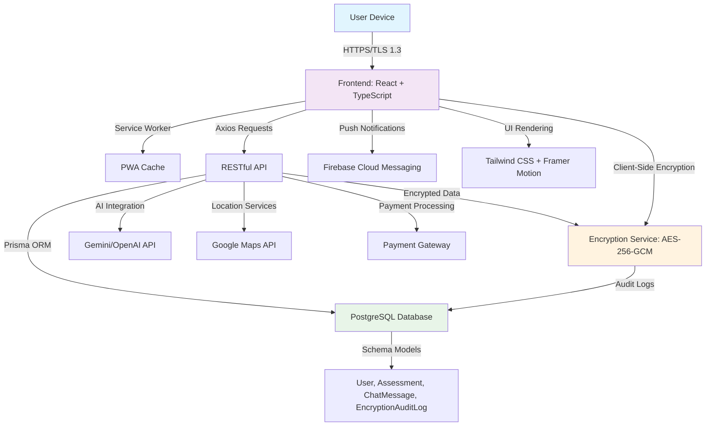
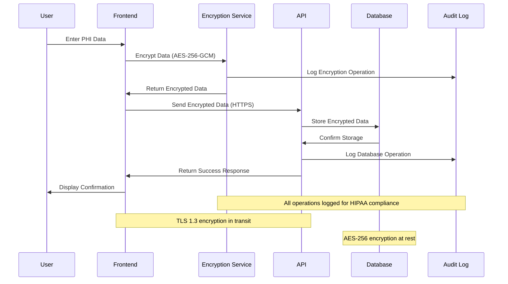

# Clynic AI - AI-Powered Healthcare Platform

[](https://opensource.org/licenses/MIT)
[](https://www.typescriptlang.org/)
[](https://reactjs.org/)
[](https://www.hhs.gov/hipaa/)
[](https://web.dev/progressive-web-apps/)

## 🏥 Overview

Clynic AI is a state-of-the-art healthcare platform leveraging artificial intelligence to provide instant medical guidance, connect users with healthcare providers, and manage sensitive health data with unparalleled security. Designed with user privacy and accessibility at its core, Clynic AI complies with **HIPAA** standards, ensuring the protection of Protected Health Information (PHI).

The platform is built as a **Progressive Web App (PWA)**, supporting offline access, push notifications, and a native-like experience. It employs military-grade encryption (AES-256-GCM, PBKDF2) and integrates modern web technologies for a scalable, secure, and responsive user experience.

### 🎯 Mission
*"Your first stop for all your medical needs"* - Democratizing healthcare access through AI-powered insights while maintaining the highest standards of data security and privacy.

## 📋 Table of Contents

1. [Features](#-features)
2. [Architecture](#-architecture)
3. [Security and HIPAA Compliance](#-security-and-hipaa-compliance)
4. [Directory Structure](#-directory-structure)
5. [Technologies Used](#-technologies-used)
6. [License](#-license)

## ✨ Features

### Core Functionality
- **🤖 AI-Powered Medical Guidance**: Interactive chat interface for symptom analysis and personalized health recommendations
- **🏥 Healthcare Provider Search**: Locate nearby doctors and hospitals with detailed profiles, ratings, and real-time availability
- **📊 Secure Health Assessments**: Encrypted health assessments for tailored medical insights
- **🔔 Push Notifications**: Real-time alerts for medication reminders, appointments, and health updates
- **💳 Payment Integration**: Secure payment processing via UPI or card for consultations and services

### Security & Compliance
- **🔒 Military-Grade Security**: Client-side encryption with AES-256-GCM and PBKDF2 key derivation
- **🏛️ HIPAA Compliant**: Full compliance with Security Rule, Privacy Rule, and Breach Notification Rule
- **🔐 Multi-Factor Authentication**: Email, Google, and phone-based sign-in with OTP verification
- **📝 Comprehensive Audit Logging**: Complete tracking of encryption operations and data access

### Technical Excellence
- **📱 Progressive Web App (PWA)**: Installable app with offline access and native-like performance
- **⚡ Performance Optimized**: Lazy loading, code splitting, and efficient caching strategies
- **🎨 Modern UI/UX**: Responsive design with smooth animations and intuitive navigation
- **🛠️ Developer Tools**: Built-in debugging console for monitoring system performance

## 🏗️ Architecture

Clynic AI is architected as a modular, scalable web application, combining a **React-based frontend**, **TypeScript** for type safety, and a **RESTful API** integrated with a **Prisma-managed PostgreSQL database**. The architecture is designed to handle high-throughput healthcare data while maintaining security and performance.

### System Architecture Diagram



### Key Architectural Components

#### Frontend Layer
- **React 18 with TypeScript**: Type-safe, component-driven UI architecture
- **React Router v6**: Client-side routing for seamless navigation
- **Tailwind CSS**: Utility-first styling for responsive design
- **Framer Motion**: Smooth animations and transitions
- **Custom Components**: Modular, reusable UI components

#### Backend Integration
- **RESTful API**: Configurable endpoints for all data operations
- **Mock APIs**: Offline development and testing capabilities
- **External Integrations**: Google Maps, Firebase, AI APIs
- **Prisma ORM**: Type-safe database operations with PostgreSQL

#### Security Layer
- **Client-Side Encryption**: AES-256-GCM with PBKDF2 key derivation
- **Audit Logging**: Comprehensive tracking of all security operations
- **HTTPS/TLS 1.3**: Secure communication protocols
- **Firebase Authentication**: Multi-provider authentication system

## 🔐 Security and HIPAA Compliance

Clynic AI implements robust security measures to protect user data and ensure compliance with HIPAA regulations, safeguarding Protected Health Information (PHI) through military-grade encryption, comprehensive audit logging, and secure authentication.

### Security Features

#### Client-Side Encryption
- **AES-256-GCM**: Galois/Counter Mode encryption for sensitive data
- **PBKDF2**: 256-bit key derivation with 100,000 iterations and SHA-256
- **Random Salts & IVs**: Unique encryption per operation (16-byte salt, 12-byte IV)
- **Base64 Encoding**: Secure data transmission over HTTPS

```typescript
// Example encryption implementation
async function encrypt(data: string, password: string): Promise<string> {
  const salt = generateSalt(16); // 16-byte salt
  const iv = generateIv(12); // 12-byte IV
  const key = await crypto.subtle.deriveKey(
    {
      name: 'PBKDF2',
      salt,
      iterations: 100000,
      hash: 'SHA-256'
    },
    await crypto.subtle.importKey('raw', new TextEncoder().encode(password), { name: 'PBKDF2' }, false, ['deriveKey']),
    { name: 'AES-GCM', length: 256 },
    false,
    ['encrypt']
  );
  const encrypted = await crypto.subtle.encrypt(
    { name: 'AES-GCM', iv },
    key,
    new TextEncoder().encode(data)
  );
  return arrayBufferToBase64(encrypted);
}
```

#### Comprehensive Audit Logging
All encryption operations are logged to the `EncryptionAuditLog` model:

```json
{
  "id": "uuid-1234",
  "operation": "encrypt",
  "success": true,
  "processingTimeMs": 15.7,
  "error": null,
  "timestamp": "2025-08-04T16:44:00Z"
}
```

### HIPAA Compliance Framework

#### Administrative Safeguards
- **Role-Based Access Control (RBAC)**: Restricted PHI access
- **Audit Controls**: Comprehensive logging of data access
- **Security Assessments**: Regular vulnerability audits
- **Staff Training**: HIPAA compliance education

#### Physical Safeguards
- **HIPAA-Compliant Hosting**: AWS with Business Associate Agreement
- **Encrypted Backups**: Secure, access-controlled storage
- **Physical Access Controls**: Restricted server access

#### Technical Safeguards
- **Data Encryption**: PHI encrypted at rest and in transit
- **Access Controls**: Strong authentication and session management
- **Data Integrity**: SHA-256 hashing for verification
- **Audit Logging**: Complete access and operation tracking

### Security Flow Diagram



## 📁 Directory Structure

```
afnan006-clynic_ai/
├── README.md
├── eslint.config.js
├── index.html
├── postcss.config.js
├── tailwind.config.js
├── vite.config.ts
├── prisma/
│   └── schema.prisma                 # Database schema with encrypted fields
├── public/
│   ├── offline.html                  # PWA offline page
│   ├── robots.txt
│   ├── service-worker.js             # PWA service worker
│   ├── sitemap.xml
│   └── manifest.json                 # PWA manifest
└── src/
    ├── App.tsx                       # Main application component
    ├── index.css                     # Global styles
    ├── main.tsx                      # Application entry point
    ├── vite-env.d.ts                # Vite type definitions
    ├── api/                         # API layer
    │   ├── axiosInstance.ts         # HTTP client configuration
    │   ├── config.ts                # API configuration
    │   ├── assessment/              # Assessment endpoints
    │   ├── auth/                    # Authentication endpoints
    │   ├── chat/                    # Chat/AI endpoints
    │   ├── mock/                    # Mock API implementations
    │   ├── notifications/           # Notification endpoints
    │   ├── payment/                 # Payment endpoints
    │   └── settings/                # Settings endpoints
    ├── components/                  # React components
    │   ├── ConsentModal.tsx         # HIPAA consent modal
    │   ├── assessment/              # Assessment components
    │   ├── auth/                    # Authentication components
    │   ├── chat/                    # Chat interface components
    │   ├── dev/                     # Development tools
    │   ├── notifications/           # Notification components
    │   ├── payment/                 # Payment components
    │   ├── settings/                # Settings components
    │   └── ui/                      # Reusable UI components
    ├── hooks/                       # Custom React hooks
    │   ├── useAuth.tsx              # Authentication hook
    │   ├── useImageLoader.ts        # Image loading hook
    │   └── useResponsive.ts         # Responsive design hook
    ├── pages/                       # Page components
    │   ├── Assessment.tsx           # Health assessment page
    │   ├── Auth.tsx                 # Authentication page
    │   ├── Chat.tsx                 # AI chat page
    │   ├── LandingPage.tsx          # Landing page
    │   └── SettingsPage.tsx         # Settings page
    ├── services/                    # Business logic services
    │   ├── NotificationService.ts   # Push notification service
    │   └── PaymentService.ts        # Payment processing service
    ├── types/                       # TypeScript type definitions
    │   ├── index.ts                 # Common types
    │   └── payment.ts               # Payment types
    └── utils/                       # Utility functions
        ├── api.ts                   # API utilities
        ├── encryption.ts            # Encryption utilities
        └── mockData.ts              # Mock data for testing
```

### Key Files Description

| File | Purpose |
|------|---------|
| `prisma/schema.prisma` | HIPAA-compliant database models with encrypted fields |
| `src/utils/encryption.ts` | AES-256-GCM and PBKDF2 encryption implementation |
| `src/components/dev/DevConsole.tsx` | Real-time system monitoring and debugging |
| `src/api/mock/` | Mock API implementations for offline development |
| `public/service-worker.js` | PWA service worker for caching and notifications |

## 🛠️ Technologies Used

### Frontend Stack
| Technology | Version | Purpose |
|------------|---------|---------|
| **React** | 18.x | Component-based UI framework |
| **TypeScript** | 5.x | Type-safe JavaScript superset |
| **Vite** | 5.x | Fast build tool and dev server |
| **Tailwind CSS** | 3.x | Utility-first CSS framework |
| **Framer Motion** | 11.x | Animation library |
| **React Router** | 6.x | Client-side routing |
| **Axios** | 1.x | HTTP client with interceptors |
| **Lucide React** | Latest | Modern icon library |

### Backend & Database
| Technology | Purpose |
|------------|---------|
| **Prisma ORM** | Type-safe database operations |
| **PostgreSQL** | Primary database with encryption |
| **RESTful API** | Backend communication protocol |

### Security & Authentication
| Technology | Purpose |
|------------|---------|
| **Web Crypto API** | Browser-native encryption (AES-256-GCM, PBKDF2) |
| **Firebase Auth** | Multi-provider authentication |
| **HTTPS/TLS 1.3** | Secure communication protocol |

### External Integrations
| Service | Purpose |
|---------|---------|
| **Google Maps API** | Location-based provider search |
| **Gemini/OpenAI API** | AI-powered chat and recommendations |
| **Firebase Cloud Messaging** | Push notifications |
| **Payment Gateways** | UPI and card payment processing |

### Development Tools
| Tool | Purpose |
|------|---------|
| **ESLint** | Code linting and quality |
| **Prettier** | Code formatting |
| **Jest/Vitest** | Unit testing framework |
| **Cypress** | End-to-end testing |


###📄 License
- **© 2025 Clynic AI. All Rights Reserved.
- **This project is proprietary software and is not open source. All rights are reserved by the author(s).
- **🚫 Restrictions

- **❌ No Commercial Use: This software may not be used for commercial purposes
- **❌ No Distribution: You may not distribute, sublicense, or sell copies of this software
- **❌ No Modification: You may not modify, adapt, or create derivative works
- **❌ No Public Use: This software is not available for public use or deployment
- **❌ No Reverse Engineering: Reverse engineering, decompilation, or disassembly is prohibited

- **✅ Permitted Uses

- **✅ Viewing: You may view the source code for educational and reference purposes only
- **✅ Learning: You may study the code structure and implementation patterns
- **✅ Portfolio Review: Authorized parties may review this code for evaluation purposes

- **📜 License Terms
- **This software and its source code is the exclusive property of the author(s). Any use, reproduction, or distribution of this software, in whole or in part, requires explicit written permission from the copyright holder(s).
- **By accessing this repository, you agree to:

- **Not use this software for any commercial or production purposes
- **Not distribute or share this software with third parties
- **Not create derivative works based on this software
- **Respect the intellectual property rights of the author(s)

- **⚖️ Legal Notice
- **Unauthorized use, reproduction, or distribution of this software may result in severe civil and criminal penalties, and will be prosecuted to the maximum extent possible under the law.
- **For licensing inquiries or permission requests, please contact: legal@clynic-ai.com


## 🙏 Acknowledgments

- **React Team** for the amazing framework
- **Anthropic** for AI integration capabilities
- **Open Source Community** for the fantastic libraries
- **Healthcare Professionals** for domain expertise
- **Security Researchers** for HIPAA compliance guidance

---

<div align="center">

**Made with ❤️ by Afnan**

[⭐ Star this repo](https://github.com/afnan006/clynic_ai) • [🐛 Report Bug](https://github.com/afnan006/clynic_ai/issues) • [💡 Request Feature](https://github.com/afnan006/clynic_ai/issues)

</div>

